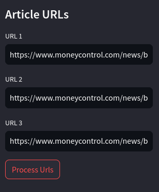
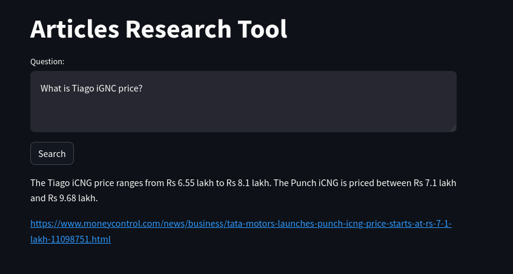
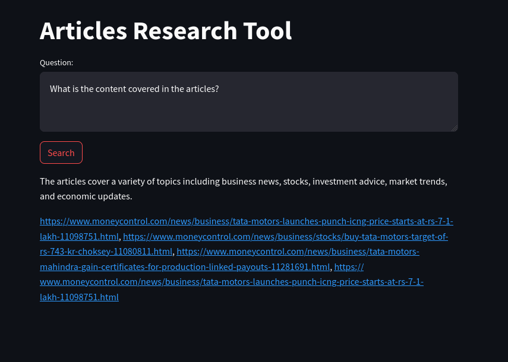

# Generative AI Articles Research Tool

### Tools
- Python
- LangChain
- Streamlit

### Concepts
- Gen AI
- LLM (OpenAI)
- Chains
- Data loaders
- Text splitters (chunk)
- Embeddings
- Vector DB

### Usage demonstration

#### Data loading
Input 3 articles links and click `Process Urls`, to transform articles into knowledge base for llm

#### Research information
Ask your question about the selected articles and click `Search`

